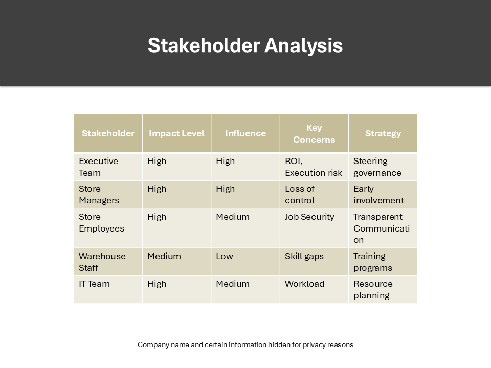
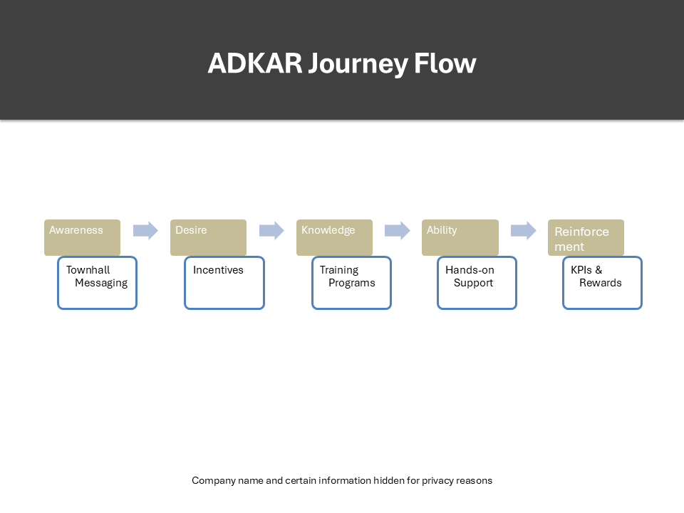

# Project-A-

# 'A' Inc. – Digital Transformation Change Strategy

##  Project Overview
This project outlines a comprehensive People & Change Management strategy for 'A', a mid-sized retail company undergoing a digital transformation.

The objective is to enable a successful transition from a brick-and-mortar operating model to a digitally enabled, e-commerce-driven business while ensuring employee adoption, minimizing resistance, and maintaining operational continuity.

---

##  Problem Statement
'A' is experiencing declining in-store sales and increasing competitive pressure from digital-native retailers. The company must implement new technologies, redesign roles, and shift organizational behaviors.

Key challenge:
How can 'A' successfully implement digital transformation while ensuring high employee adoption and minimal disruption?

---

##  Key Deliverables
- Stakeholder Analysis
- Change Strategy (ADKAR + Kotter)
- Communication Plan
- Training & Adoption Plan
- Resistance Mitigation Strategy
- Implementation Roadmap
- Success Metrics

---
## Stakeholder Mapping

## ADKAR Journey

##  Skills Demonstrated
- Change Management (ADKAR, Kotter)
- Stakeholder Mapping
- Strategic Communication
- Organizational Transformation
- Workforce Planning
- Consulting Problem Structuring

---

##  Key Insight
The success of 'A'’s transformation is not technology-driven—it is adoption-driven. Without structured change management, digital investments will fail to generate ROI.

---

##  Outcome (Projected)
- 75%+ adoption of new systems within 6 months
- 20% increase in e-commerce revenue
- Improved employee engagement during transition

---
